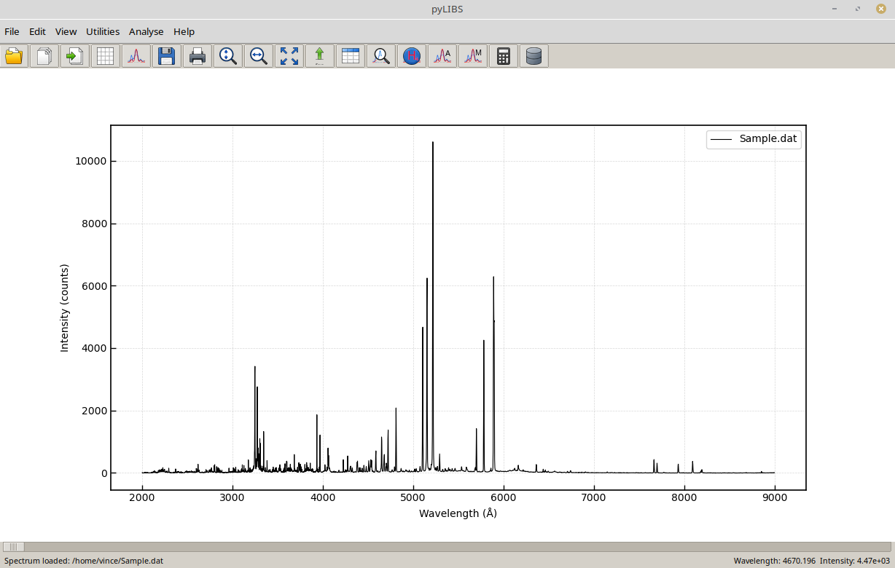

## pyLIBS

Python software for visualization, spectral processing, plasma diagnostics and quantitative analysis of Laser-Induced Breakdown Spectroscopy (LIBS) data.

pyLIBS is a source-available scientific software package for the visualization, processing, interpretation, and quantitative analysis of Laser-Induced Breakdown Spectroscopy (LIBS) spectra.

The software has been developed to provide researchers, students, and laboratory users with a modern and intuitive environment for LIBS data analysis while preserving compatibility with historical databases and workflows established over many years of research.

## Screenshot

## Current Status

pyLIBS is under active development.

The current public release already includes the core functionality required for:

- spectrum visualization
- spectral fitting
- plasma diagnostics
- quantitative analysis

Additional functionality and documentation will be added in future releases.

## Main Features
- Spectrum Visualization
- Interactive visualization of single and multiple LIBS spectra
- Zoom and pan tools
- Linear and logarithmic axes
- Configurable background color
- Grid display
- Trace line visualization
- Spectrum comparison
- Spectral Line Identification
- Automatic line identification
- Manual line assignment
- Interactive template management
- Incremental template updating
- Support for historical LIBS line databases
- Spectral Fitting
- Single and multiple peak fitting
- Voigt profile fitting
- Automatic and manual fitting modes
- Batch fitting of multiple spectra
- Export of fitting results to Microsoft Excel
- Plasma Diagnostics
- Saha–Boltzmann analysis
- Calibration-Free LIBS (CF-LIBS)
- Self-absorption correction tools
- Stark broadening analysis
- Electron density estimation
- Plasma temperature evaluation
- Data Management
- Persistent user preferences
- Automatic restoration of window positions
- Import and export of templates
- Excel report generation

## Scientific Scope

pyLIBS is intended for applications including, but not limited to:

- elemental analysis
- quantitative LIBS
- plasma diagnostics
- calibration-free LIBS
- laboratory spectroscopy
- field-portable LIBS
- cultural heritage
- archaeometry
- environmental monitoring
- industrial process control
- teaching and research

## Installation

Clone the repository:

git clone <repository-url>
cd pyLIBS

Install the required Python packages:

pip install -r requirements.txt
Running pyLIBS

Start the program with:

python pyLIBS.py

## Requirements

- Python 3.11 or later
- NumPy
- SciPy
- Matplotlib
- OpenPyXL

Tested on

- Linux
- Windows
- macOS

## Required Data Files

pyLIBS uses several scientific databases required for spectral identification and plasma diagnostics.

The repository includes the databases required for the public release.

User-specific configuration is intentionally not distributed.

At the first execution, pyLIBS automatically creates a local configuration file based on the supplied example configuration.

## Documentation

The repository currently includes:

- Project documentation
- License information
- Citation information

A comprehensive user manual is under preparation and will be expanded in future releases.

## Citation

If you use pyLIBS in scientific work, please cite the software using its Zenodo DOI:

**https://doi.org/10.5281/zenodo.21342458**

The DOI always resolves to the latest public release of pyLIBS.

## License

pyLIBS is distributed under the pyLIBS Academic Non-Commercial License (ANCL) v1.0.

The software may be freely used for research, education, and other non-commercial purposes.

Commercial use requires prior written permission from the copyright holder.

See the LICENSE file for the complete license terms.

## Contributing

External contributions are welcome.

Please open an Issue before proposing major changes.

Please use the GitHub Issues page to report problems or propose improvements.

## History

pyLIBS represents the continuation and modernization of the historical LIBS++ software, preserving many years of development experience while providing a modern Python-based implementation.

## Author

Vincenzo Palleschi

Institute of Chemistry of Organometallic Compounds (ICCOM)
National Research Council (CNR)
Pisa, Italy

Developer and maintainer of pyLIBS
